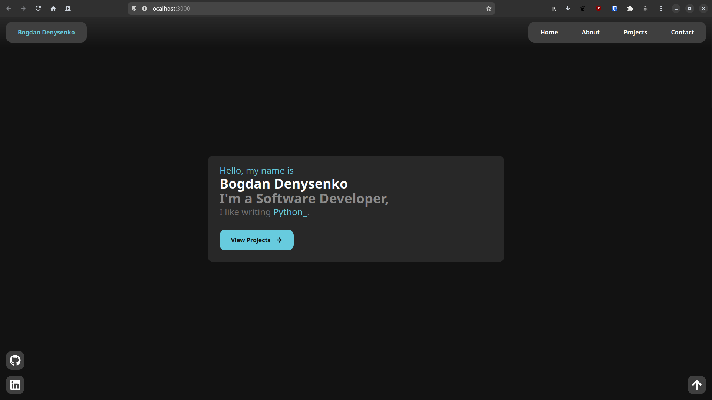

# Personal Portofolio Website

This is a personal project website made using React / TypeScript / TailwindCSS with the purpose of learning the React library and the TypeScript language



## Requirements

Install the following packages via npm

- react-icons
- typewriter-effect

## Getting the project

Run the following commands in the terminal of your choice

```sh
git clone https://github.com/bogddeny/portofolio-website
cd portofolio-website/
```

## Installing requirements

In the same terminal run the following commands

```sh
npm install react-icons
npm install typewriter-effect
```

## Running the project

If you installed all the requirements properly run the command ```npm start``` and then open a web browser at the following address ```localhost:3000```

